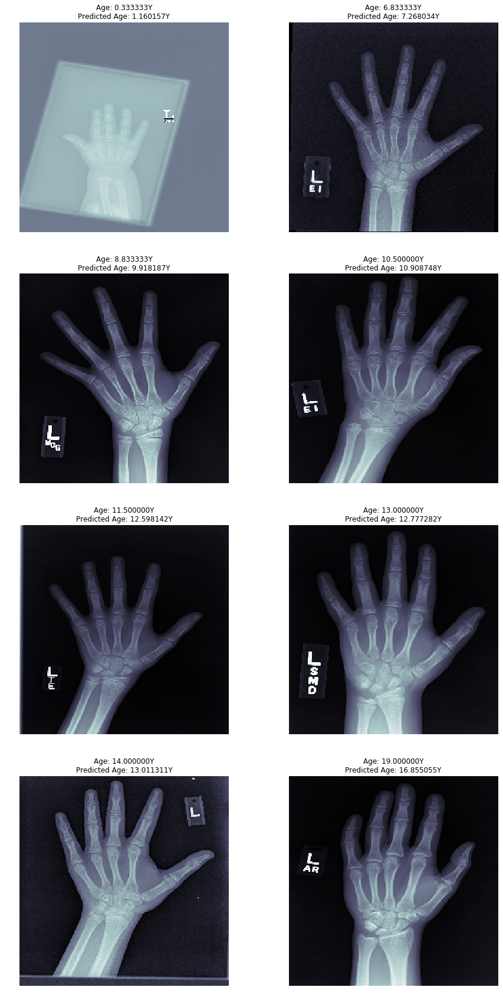

# Predicting-ages-of-bones-from-X-Rays
This notebook explore the dataset used in the Pediatric Bone Age Challenge, 2017, also known as the RSNA(Radiological Society of North America) and attempts to predict the ages of children using X-Ray images of their hands.More information about the dataset and the dataset itself can be found on kaggle <a href = 'https://www.kaggle.com/kmader/rsna-bone-age'>here.</a> 
## Model description
The notebook uses the pre-trained model Xception to predict ages.The ImageDataGenerator class from keras has been used to enable efficient loading, preprocessing and augmentation of the dataset.The model obtained a mean absolute error of approximately 7.6 months. 
## Requirements
<ul>
  <li> <b>Tensorflow:</b> To use Xception and related functions for training and preprocessing( keras is included in tensorflow)</li>
  <li><b> Numpy:</b> For computation on the dataset</li> 
  <li><b> Pandas:</b> To load csv files and plot data</li>
  <li><b> Matplotlib:</b> For creating visualisations</li>
  <li><b> Seaborn:</b> For creating visualisations</li>
  <li><b>Sklearn:</b> To split data into training and validation</li>
  </ul>
  
## Results
</img>
  
## Improvements possible
InceptionResNetV2 might perform slightly better but it wasn't possible to train it because of the large size of its weights.There are many combinations of models possible using different pre-trained models, optimizers and learning rates.  
The same notebook is available on kaggle <a href = 'https://www.kaggle.com/daenys2000/bone-age-prediction'>here.</a>
